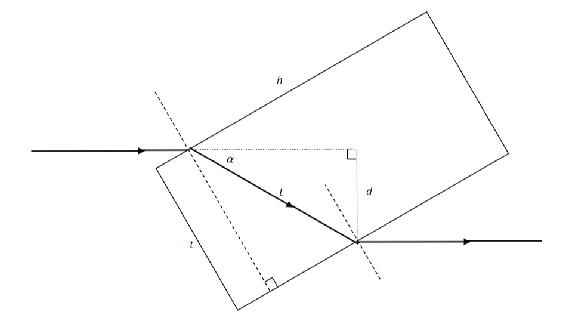

# p.77 R8 

**a)** $\theta_1$ is the angle between the incoming light ray and the first (from the left) dashed surface normal. $\theta_2$ is the angle between the light path labeled $L$ and the same dashed line. $\theta_3$ is the angle between the light path $L$ and the second dashed surface normal and $\theta_4$ is the angle between the outgoing light ray and the same second (from the left) dashed line.

**b)** $\theta_2$ and $\theta_3$ are equal because the two faces of the prism of length $h$ are parallel to each other so these two angles are alternate interior angles. $\theta_1$ and $\theta_4$ are therefore equal to each other because the first first two angles are equal 

$$
n_1\sin\theta_1 = n_2\sin\theta_2 = n_2\sin\theta_3 = n_1\sin\theta_4
$$

**c)** The figure makes sense as long as $n_1 < n_2$

**d)** 
$90^\circ - \theta_1 + \alpha + \theta_2 = 90^\circ$ 
$\Rightarrow \theta_1 - \theta_2 = \alpha$

**e)**

$$
\begin{aligned}
\frac{t}{\cos\theta_2} &= L\\
L\sin\alpha &= d\\
d &= t\frac{\sin\alpha}{\cos\theta_2}\\
\end{aligned}
$$

where:

$$
\begin{aligned}
\alpha &= \left(1 - \frac{n_1}{n_2}\right)\sin\theta_1\\
\theta_2 &= \arcsin\left(\frac{n_1}{n_2}\sin\theta_1\right)
\end{aligned}
$$

# p. 102 R6

$$
\begin{aligned}
\frac{1}{f_1} &= \frac{1}{d_{o1}} + \frac{1}{d_{i1}}\\
\frac{1}{f} &= \frac{1}{2f} + \frac{1}{d_{i1}}\\
\frac{1}{d_{i1}} &= \frac{1}{f} - \frac{1}{2f}\\
d_{i1} &= 2f
\end{aligned}
$$

The image from the first lens is formed at a distance $2f$ past the lens. This puts the image at $4f$ from the second lens. So

$$
\begin{aligned}
\frac{1}{f_2} &= \frac{1}{d_{o2}} + \frac{1}{d_{i2}}\\
\frac{1}{-2f} &= \frac{1}{4f} + \frac{1}{d_{i2}}\\
\frac{1}{d_{i2}} &= \frac{1}{4f} - \frac{1}{-2f}\\
d_{i2} &= \frac{4}{3}f
\end{aligned}
$$

This last distance is measured from the second (diverging) lens. The second lense therefore applies a magnification of $-d_{i2}/d_{o2} = -1/3$ Since the first lens gave a magnification of -1, the overall magnification is $+1/3$ .

# p. 102 R7

In general for light passing through a lens to a mirror and then back through the lens:

$$
\begin{pmatrix}
yout \\ 
\theta out \\ 
\end{pmatrix}
=
\begin{bmatrix}
1 & d_i \\
0 & 1 \\
\end{bmatrix}
\begin{pmatrix}
1 & 0 \\
-\frac{1}{f} & 1 \\
\end{pmatrix}
\begin{pmatrix}
1 & d_1 \\
0 & 1 \\
\end{pmatrix}
\begin{pmatrix}
1 & 0 \\
-\frac{2}{R} &1 \\
\end{pmatrix}
\begin{pmatrix}
1 & d_1 \\
0 & 1 \\
\end{pmatrix}
\begin{pmatrix}
1 & 0 \\
-\frac{1}{f} & 1 \\
\end{pmatrix}
\begin{pmatrix}
1 & d_o \\
0 & 1 \\
\end{pmatrix}
\begin{pmatrix}
y_{in} \\
\theta_{in} \\
\end{pmatrix}
$$
which can be collected first to:

$$
\begin{pmatrix}
y_{out} \\
\theta_{out} \\
\end{pmatrix}
=
\begin{pmatrix}
1 &d_i \\
0 &1 \\
\end{pmatrix}
\begin{pmatrix}
1 &d_1 \\
-\frac{1}{f} &1 - \frac{d_1}{f} \\
\end{pmatrix}
\begin{pmatrix}
1 & 0 \\
-\frac{2}{R} &1 \\
\end{pmatrix}
\begin{pmatrix}
1 &d_1 \\
0 &1 \\
\end{pmatrix}
\begin{pmatrix}
1 &d_o \\
-\frac{1}{f} &1 - \frac{d_o}{f} \\
\end{pmatrix}
\begin{pmatrix}
y_{in} \\
\theta_{in} \\
\end{pmatrix}
$$

and then to:

$$
\begin{pmatrix}
y_{out} \\
\theta_{out} \\
\end{pmatrix}
=
\begin{pmatrix}
1 &d_i \\
0 &1 \\
\end{pmatrix}
\begin{pmatrix}
1 &d_1 \\
-\frac{1}{f} &1 - \frac{d_1}{f} \\
\end{pmatrix}
\begin{pmatrix}
1 &d_1 \\
-\frac{2}{R} &1 - \frac{2d_1}{R} \\
\end{pmatrix}
\begin{pmatrix}
1 &d_o \\
-\frac{1}{f} &1 - \frac{d_o}{f} \\
\end{pmatrix}
\begin{pmatrix}
y_{in} \\
\theta_{in} \\
\end{pmatrix}
$$

and finally:

$$
\begin{pmatrix}
y_{out}\\
\theta_{out}
\end{pmatrix}
=
\begin{pmatrix}
1-\frac{d_i}{f} &d_1+d_i\left(1-\frac{d_1}{f}\right)\\
-\frac{1}{f} &1 - \frac{d_1}{f}
\end{pmatrix}
\begin{pmatrix}
1 &d_1\\
-\frac{2}{R} &1 - \frac{2d_1}{R}
\end{pmatrix}
\begin{pmatrix}
1 &d_o\\
-\frac{1}{f} &1 - \frac{d_o}{f}
\end{pmatrix}
\begin{pmatrix}
y_{in}\\
\theta_{in}
\end{pmatrix}
$$

$$
\begin{pmatrix}
y_{out}\\
\theta_{out}
\end{pmatrix}
=
\begin{pmatrix}
1-\frac{d_i}{f} &d_1+d_i\left(1-\frac{d_1}{f}\right)\\
-\frac{1}{f} &1 - \frac{d_1}{f}
\end{pmatrix}
\begin{pmatrix}
1-\frac{d_1}{f} &d_o+d_1\left(1-\frac{do}{f}\right)\\
-\frac{2}{R} - \frac{1}{f}\left(1-\frac{2d_1}{R}\right) &-\frac{2d_o}{R} + \left(1-\frac{2d_1}{R}\right)\left(1 - \frac{d_o}{f}\right)
\end{pmatrix}
\begin{pmatrix}
y_{in}\\
\theta_{in}
\end{pmatrix}
$$
This will give a matrix equation of the form 

$$
\begin{pmatrix}
y_{out}\\
\theta_{out}
\end{pmatrix}
=
\begin{pmatrix}
A &B\\
C &D
\end{pmatrix}
\begin{pmatrix}
y_{in}\\
\theta_{in}
\end{pmatrix}
$$
with 

$$
B = \left(1-\frac{d_i}{f}\right)\left(d_o+d_1\left(1-\frac{do}{f}\right)\right) + \left(d_1+d_i\left(1-\frac{d_1}{f}\right)\right)\left(-\frac{2d_o}{R} + \left(1-\frac{2d_1}{R}\right)\left(1 - \frac{d_o}{f}\right)\right)
$$

$d_i$ can be found by setting $B=0$ and solving. 

The magnification will just be equal to $A$ when $B = 0$. 

$$
A = \left(1-\frac{d_i}{f}\right) \left(1-\frac{d_1}{f}\right) + \left(-\frac{1}{f}\right)\left(-\frac{2}{R} - \frac{1}{f}\left(1-\frac{2d_1}{R}\right)\right)
$$
and the $d_i$ found from $B=0$ above can be substituted in.

For our specific setup, $d_o = 4, d_1 = 8f$, and $R=4f$ so
$$
\begin{pmatrix}
y_{out}\\
\theta_{out}
\end{pmatrix}
=
\begin{pmatrix}
1 &d_i\\
0 &1
\end{pmatrix}
\begin{pmatrix}
1 & 0\\
-\frac{1}{f} &1
\end{pmatrix}
\begin{pmatrix}
1 &8f\\
0 &1
\end{pmatrix}
\begin{pmatrix}
1 & 0\\
-\frac{2}{4f} &1
\end{pmatrix}
\begin{pmatrix}
1 &8f\\
0 &1
\end{pmatrix}
\begin{pmatrix}
1 & 0\\
-\frac{1}{f} &1
\end{pmatrix}
\begin{pmatrix}
1 &4f\\
0 &1
\end{pmatrix}
\begin{pmatrix}
y_{in}\\
\theta_{in}
\end{pmatrix}
$$

and the same replacements can be made in the results for $d_i$ and $A$.